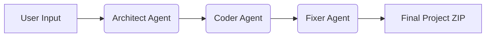

# 🤖 AutoDev AI - Autonomous Backend Generator

[](https://autodev-ai.onrender.com/)
[](https://www.python.org/)
[](https://fastapi.tiangolo.com/)
[](https://reflex.dev/)

AutoDev AI is a powerful, agentic AI platform designed to automate backend generation. Built on **LangGraph** and powered by **Google Gemini**, it orchestrates specialized agents—Architect, Coder, and Fixer—to transform your project requirements into a complete, working backend project in minutes.

Instead of writing boilerplate code, AutoDev AI thinks like a senior developer: planning the architecture, writing the code, and proactively fixing bugs before you even see them.

## ✨ Features in Action

| Planning Phase | Coding & Fixing |
| :---: | :---: |
| 📋 **Architect Agent** creates a structured plan and tech stack decisions. | 💻 **Coder Agent** generates modular, production-ready backend code. |
| 🔧 **Fixer Agent** reviews the generated code for deterministic bugs. | 💾 **Project Export** allows you to download the complete source code as a ZIP. |

> [!NOTE]
> Screenshots and demos coming soon! The platform currently supports Python (FastAPI/Flask) and Node.js (Express) backend generation.

## 🌟 Key Features

- **Agentic Orchestration:**
    - **Architect Agent:** Analyzes user requirements and designs the system architecture.
    - **Coder Agent:** Implements the design into high-quality source code.
    - **Fixer Agent:** A specialized agent that catches and fixes common bugs proactively.
- **Real-Time Progress:**
    - **Streaming Logs:** Watch the agents work in real-time with an interactive log stream in the UI.
    - **State Merging:** Seamlessly integrates updates from multiple agents into a final project state.
- **Production-Ready Output:**
    - Generated projects are structured according to best practices.
    - Includes `README.md`, `requirements.txt`, and organized directory structures.
    - One-click **ZIP Download** for immediate local development.
- **Modern Tech Stack:**
    - **Backend:** FastAPI for high-performance API handling.
    - **Frontend:** Reflex for a sleek, interactive, and reactive user interface.
    - **Core:** LangGraph for sophisticated agentic workflows.

## 🚀 The Workflow

AutoDev AI uses a linear LangGraph pipeline to ensure consistency and quality:



1.  **Architect**: Decides on the tech stack, directory structure, and file plan.
2.  **Coder**: Iteratively generates files based on the architect's plan.
3.  **Fixer**: Runs a specialized validation pass to ensure code integrity.

## 📖 Getting Started

Follow these steps to set up and run AutoDev AI locally.

### Prerequisites

- Python 3.9+
- [Google AI API Key](https://aistudio.google.com/) (Gemini 1.5 Pro or Flash)

### Installation & Setup

1.  **Clone the Repository:**
    ```bash
    git clone https://github.com/your-username/Autodev-AI.git
    cd Autodev-AI
    ```

2.  **Set up the Python Environment:**
    ```bash
    python -m venv venv
    source venv/bin/activate  # On Windows: venv\Scripts\activate
    pip install -r requirements.txt
    ```

3.  **Environment Variables:**
    Create a `.env` file in the root directory:
    ```env
    GOOGLE_API_KEY="YOUR_GEMINI_API_KEY"
    MODEL_NAME="gemini-1.5-pro" # Or gemini-1.5-flash
    ```

### Running the Application

AutoDev AI consists of a FastAPI backend and a Reflex frontend.

1.  **Start the Backend:**
    ```bash
    uvicorn app.main:api --reload --port 8000
    ```

2.  **Start the Frontend:**
    ```bash
    cd frontend
    reflex run
    ```

## 🛠️ API Reference

| Endpoint | Method | Description |
| :--- | :--- | :--- |
| `/build` | `POST` | The main build endpoint. Streams agent logs and the final result. |
| `/download/{project_name}` | `GET` | Downloads the generated project as a ZIP file. |


